# Tutorial 6 - Mongo DB Atlas

### Author - [Siddharth](sd812175@dal.ca)

- Group Repo Link - https://git.cs.dal.ca/parkar/CSCI-5709-Group8
- Group Repo (Personal Branch) - https://git.cs.dal.ca/parkar/CSCI-5709-Group8/-/tree/siddharth
---
- Individual Repo Link (Github) - https://github.com/samurai-green/CSCI-5709-Tutorials
- Individual Repo Link (Gitlab) - https://git.cs.dal.ca/siddharthb/CSCI-5709-Tutorials
---

### [Netlify Deployment Link](https://tut5.netlify.app/.netlify/functions/api/users)


- Instance hosted properly
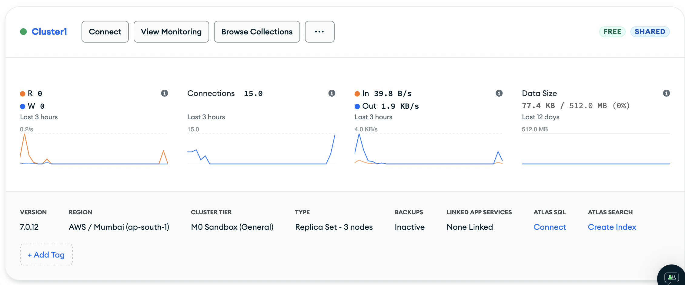
- Connecting to instance
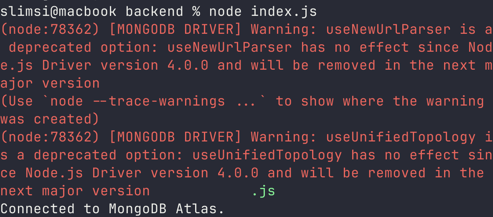
- Create a simple database schema and attach to the instance
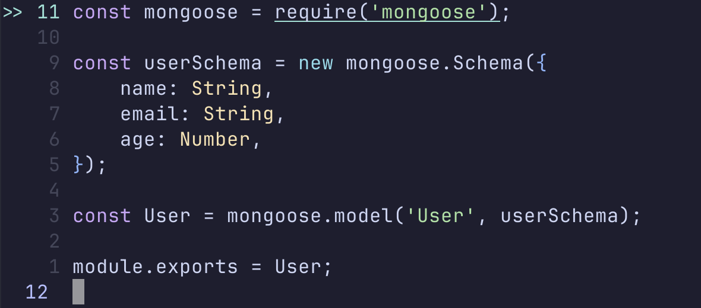
- A query to insert multiple records  and result
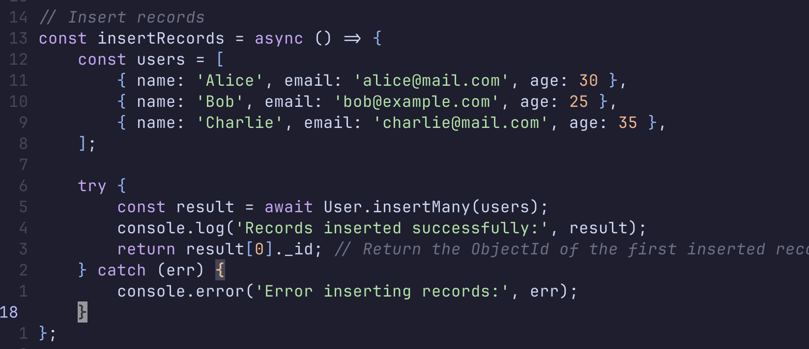
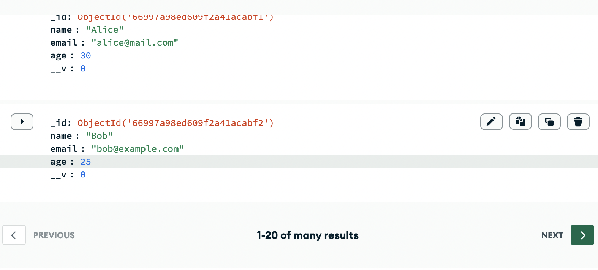
- A query to retrieve multiple records and result
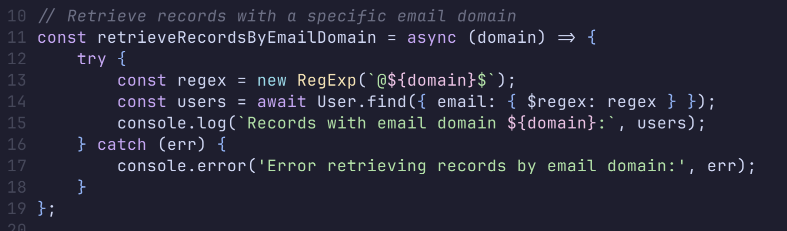
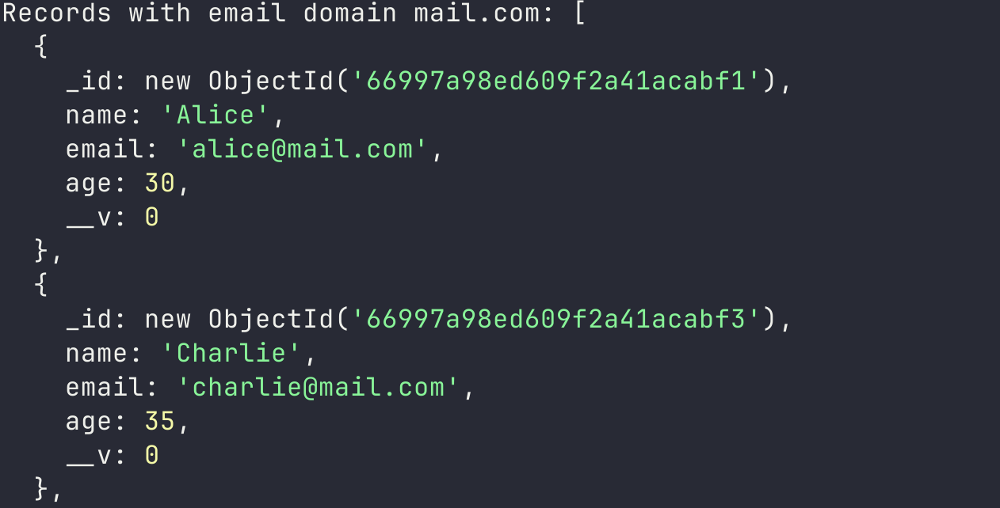
- A query to update a record and result
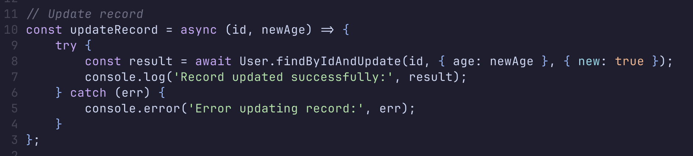
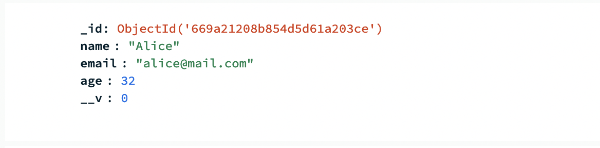
- A query to retrieve a specific record and result
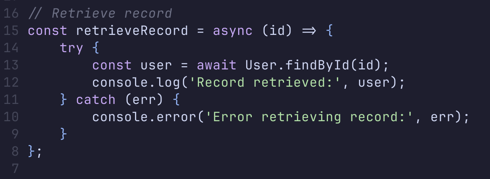
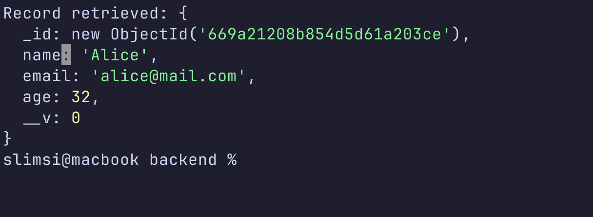

- *Date Created*: 18 Jul 2024
- *Last Modification Date*: 18 Jul 2024


### Prerequisites

To have a local copy of this lab / assignment / project up and running on your
local machine, you will first need to install the following software / libraries
/ plug-ins

```
nodejs / npm

```

See the following section for detailed step-by-step instructions on how to
 install this software / libraries / plug-ins


### Deploy (Netlify)


```
$ npm run start
```
To build

```
$ npm run build
```

## Built With

<!--- Provide a list of the frameworks used to build this application, your list
should include the name of the framework used, the url where the framework is 
available for download and what the framework was used for, see the example 
below --->

- [NodeJS](https://nodejs.org/en) - JavaScript Runtime


## Sources Used

If in completing your lab / assignment / project you used any interpretation of
someone else's code, then provide a list of where the code was implemented, how
it was implemented, why it was implemented, and how it was modified. See the 
sections below for more details.


### File Name

## Artificial Intelligence Tools Used

### Prompt Used on *NAME OF AI TOOL*

## Acknowledgments
